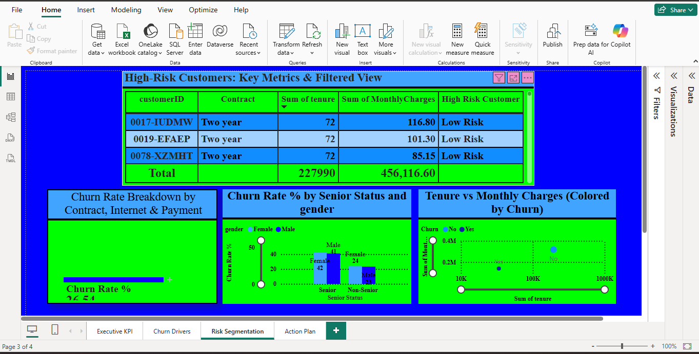

# Telco Customer Churn Analysis – Power BI Dashboard

## Welcome to My Data Analytics Portfolio Project
*"Turning raw customer data into million-dollar retention strategies"*

---

## Project Overview
Imagine you run a phone and internet company with **7,043 customers**. Every month, customers leave to join competitors. That’s called **churn** – and it’s a big problem because finding new customers costs **5x more** than keeping existing ones.

**This project answers one critical question:**
> *"Why are customers leaving, and how can we stop it?"*

I built an **interactive 4-page Power BI dashboard** that reveals exactly why customers leave, when they leave, and how much money the company is losing.

---

## Dashboard Preview

### Page 1: Executive KPI Summary


| Metric                | Value        |
|-----------------------|--------------|
| Total Customers       | 7,043        |
| Churn Rate            | 26.54%       |
| Monthly Revenue Lost  | $139,130     |
| Total Revenue Lost    | $2.86M       |
| Avg Tenure (Churned)  | 17.98 months |

---

### Page 2: Why Churn Happens


**Key insights:**
- 63% of churn happens in first 12 months  
- Customers without Online Security churn 3x more  
- Electronic check users churn 4x more than auto-pay  

---

### Page 3: Contract Impact Matrix


| Contract Type   | Churned Customers | Churn Rate |
|-----------------|-------------------|------------|
| Month-to-month  | 1,655             | 42.7%      |
| One year        | 166               | 11.3%      |
| Two year        | 48                | 2.8%       |

**Insight:** Month-to-month customers are 15x more likely to churn.

---

### Page 4: Action Plan


## Recommendations
### 1. Month-to-Month Contract Crisis
- 75% of churn comes from MTM customers  
- Offer $10/month discount for switching to 1-year contracts  
- **Potential savings:** $140,000+ monthly  

### 2. Electronic Check Payment Problem
- Customers paying via electronic check have 4x higher churn rate than auto-pay users  
- Send SMS reminders 5 days before due date  
- Offer $5 credit for switching to auto-pay  

### 3. Security Services = Retention
- Customers without Online Security churn 3x more  
- Bundle **Tech Support + Security** for $10/month  
- Target MTM fiber customers first  

### 4. First 12 Months are Critical
- 60% of churn happens in the first year  
- Implement a **VIP Onboarding Program**  
- Monthly check-in calls at months 3, 6, and 9  

---

## Dataset
- **Source:** IBM Telco Customer Churn dataset  
- **Rows:** 7,043 customers  
- **Columns:** 21 features (demographics, services, billing, churn status)  

---

## Data Cleaning (Power Query)
| Issue | Solution |
|-------|----------|
| `TotalCharges` had nulls for new customers | Replaced with 0 |
| `TotalCharges` imported as text | Converted to decimal |
| `SeniorCitizen` was 0/1 | Created readable "Senior Status" |
| Tenure numeric only | Created grouped "Tenure Group" |

---

## Calculated Columns
```dax
Tenure Group = 
SWITCH(
    TRUE(),
    [tenure] <= 12, "0-12 Months",
    [tenure] <= 24, "13-24 Months",
    [tenure] <= 48, "25-48 Months",
    "48+ Months"
)
dax
Senior Status = 
IF([SeniorCitizen] = 1, "Senior", "Non-Senior")
dax
High Risk Customer = 
IF(
    [Contract] = "Month-to-month" &&
    [InternetService] = "Fiber optic" &&
    [PaymentMethod] = "Electronic check",
    "High Risk",
    "Low Risk"
)
DAX Measures (Highlights)
Total Customers: 7,043

Churned Customers: 1,869

Churn Rate: 26.54%

Monthly Revenue Lost: $139,130

Total Revenue Lost: $2.86M

Avg Tenure (Churned): 17.98 months

Risk Score: Advanced measure combining contract, payment, and security

Business Impact
Recommendation	Monthly Savings
Convert 10% of MTM to 1-year contracts	$29,100
Switch 20% of Electronic check to auto-pay	$28,800
Bundle security for fiber MTM customers	$20,250
Improve first-year retention by 10%	$16,125
Total Monthly Savings	$94,275
Annual Savings	$1,131,300


Tools Used
Power BI Desktop – dashboard creation

Power Query Editor – data cleaning

DAX – measures and calculated columns

Excel – initial data exploration

Files in Repository
WA_Fn-UseC_-Telco-Customer-Churn.csv – raw dataset

Telco_Churn_Dashboard.pbix – Power BI file

image1.png – KPI Summary

image2.png – Churn Analysis

image3.png – Contract Matrix

image4.png – Recommendations

README.md – documentation

Key Insights Summary
First Year Crisis: 63% of churn happens in first 12 months

Contract Length Matters: Month-to-month churn = 42.7% vs 2.8% for two-year contracts

Payment Method Warning: Electronic check retention = 55% vs 85% for credit card users

Security Saves Customers: No Online Security = 3x higher churn

Revenue Impact: $139,130 lost monthly, $2.86M lifetime value lost
