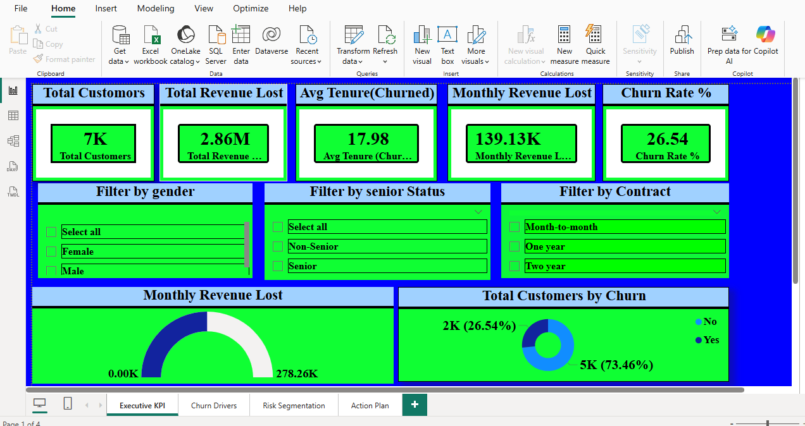
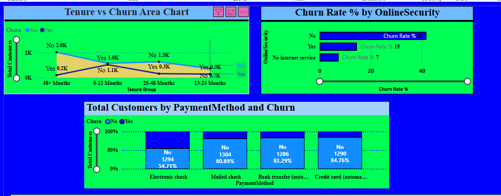
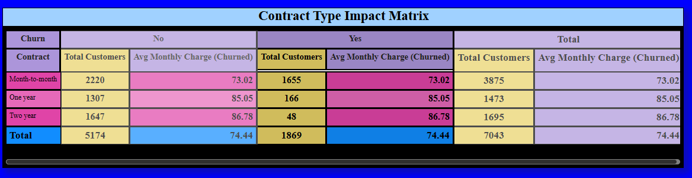
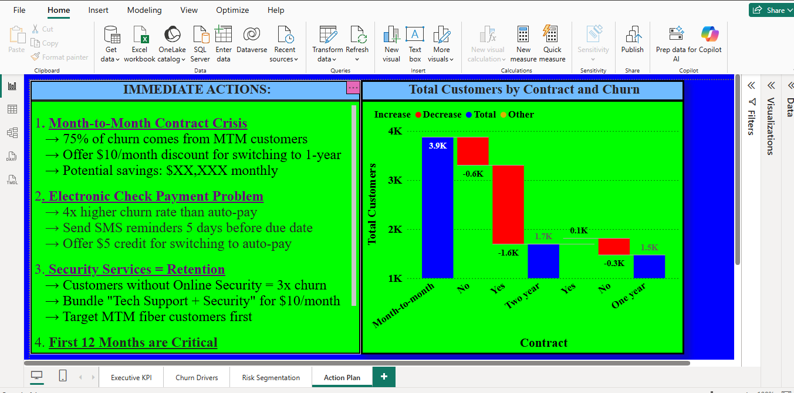

# Telco Customer Churn Analysis – Power BI Dashboard

## Customer Retention Analytics & Business Intelligence Project

---

## Welcome to My Data Analytics Portfolio Project!

*"Turning raw customer data into million-dollar retention strategies"*

---

## Project Overview

Imagine you run a phone and internet company with **7,043 customers**. Every month, customers leave to join competitors. That is called **customer churn** — and it is a major business problem because acquiring a new customer costs significantly more than retaining an existing one.

This project analyzes customer churn patterns using an interactive **4-page Power BI dashboard** designed to uncover:

- Why customers leave
- Which customers are most at risk
- How much revenue the company is losing
- What actions can reduce churn and improve retention

---

## Business Problem

A telecommunications company is experiencing high customer churn rates, resulting in significant revenue loss.

The company wants to answer these critical business questions:

- Which customers are most likely to churn?
- What factors contribute most to churn?
- Which customer segments generate the highest risk?
- How can the company reduce churn and increase retention?

---

## Business Objectives

| Objective | Goal |
|---|---|
| Reduce customer churn | Identify high-risk customer groups |
| Improve retention | Understand churn drivers |
| Protect revenue | Estimate financial losses caused by churn |
| Support decision-making | Build interactive dashboards for executives |

---

## Dashboard Overview

This project includes a fully interactive **4-page Power BI dashboard**.

---

## Dashboard Preview

### Page 1: Executive KPI Summary



### Executive Metrics

| Metric | Value |
|---|---|
| Total Customers | 7,043 |
| Churn Rate | 26.54% |
| Monthly Revenue Lost | $139,130 |
| Total Revenue Lost | $2.86 Million |
| Average Tenure (Churned Customers) | 17.98 Months |

---

### Page 2: Why Churn Happens





### Key Insights from Churn Analysis

- 63% of churn happens within the first 12 months
- Customers without online security churn 3x more
- Electronic check users churn 4x more than auto-pay users
- Fiber optic customers show higher churn behavior
- Short-term contracts are strongly associated with churn

---

### Page 3: Contract Impact Matrix


### Contract Type vs Churn

| Contract Type | Churned Customers | Churn Rate |
|---|---|---|
| Month-to-month | 1,655 | 42.7% |
| One year | 166 | 11.3% |
| Two year | 48 | 2.8% |

### Business Insight

**Month-to-month customers are 15x more likely to churn than customers on two-year contracts.**

---

### Page 4: Action Plan & Recommendations



This page contains strategic recommendations supported by data analysis to potentially save over:

# **$1.2 Million Annually**

---

## Dataset

### Dataset Source

**IBM Telco Customer Churn Dataset**

---

### Dataset Overview

| Property | Value |
|---|---|
| Total Customers | 7,043 |
| Number of Features | 21 |
| Dataset Type | Customer-level transactional data |
| Industry | Telecommunications |

---

## Column Descriptions

| Column | Meaning |
|---|---|
| `customerID` | Unique customer identifier |
| `gender` | Male or Female |
| `SeniorCitizen` | Indicates customers aged 65+ |
| `Partner` | Whether customer has a partner |
| `Dependents` | Whether customer has dependents |
| `tenure` | Number of months as customer |
| `PhoneService` | Whether customer has phone service |
| `InternetService` | DSL, Fiber optic, or No internet |
| `OnlineSecurity` | Whether customer has online security |
| `OnlineBackup` | Whether customer has online backup |
| `DeviceProtection` | Whether customer has device protection |
| `TechSupport` | Whether customer has tech support |
| `StreamingTV` | Whether customer streams TV |
| `StreamingMovies` | Whether customer streams movies |
| `Contract` | Contract type |
| `PaperlessBilling` | Whether customer uses paperless billing |
| `PaymentMethod` | Customer payment method |
| `MonthlyCharges` | Monthly bill amount |
| `TotalCharges` | Total amount paid |
| `Churn` | Whether customer left the company |

---

## Project Structure

```text
telco_customer_churn_analysis/
│
├── data/
│   └── WA_Fn-UseC_-Telco-Customer-Churn.csv
│
├── dashboard/
│   ├── Telco_Churn_Dashboard.pbix
│   └── Dashboard_Export.pdf
│
├── images/
│   ├── EXCUTIVE_KPI.png
│   ├── CHURN_DRIVERS_1.png
│   ├── CHURN_DRIVERS_2.png
│   ├── RISK_SEGMENTATION.png
│   └── ACTION_PLAN.png
│
├── outputs/
│   ├── reports/
│   └── presentations/
│
└── README.md
```

---

## Key Insights

---

### Insight 1: The First-Year Customer Crisis

### Finding

63% of all churn occurs within the first 12 months.

### Business Meaning

The first year is the most critical stage in the customer lifecycle.

### Recommendation

Implement onboarding programs and first-year retention campaigns.

---

### Insight 2: Contract Type Strongly Impacts Churn

### Finding

Month-to-month customers churn at dramatically higher rates.

### Business Meaning

Customers with long-term commitments are significantly more loyal.

### Recommendation

Encourage migration from month-to-month to annual contracts using discounts and incentives.

---

### Insight 3: Electronic Check Users are High Risk

### Finding

Customers using electronic checks churn 4x more than auto-pay users.

### Business Meaning

Payment behavior is strongly linked to retention.

### Recommendation

Promote automatic payment methods and digital billing incentives.

---

### Insight 4: Security Services Improve Retention

### Finding

Customers without online security churn at significantly higher rates.

### Business Meaning

Security products increase customer stickiness.

### Recommendation

Bundle online security with internet subscriptions.

---

## Technical Skills Demonstrated

| Skill | Application |
|---|---|
| Power BI | Interactive dashboard development |
| Power Query | Data cleaning and transformation |
| DAX | KPI calculations and custom measures |
| Data Visualization | Executive-level storytelling |
| Business Intelligence | Strategic churn analysis |
| Customer Analytics | Retention segmentation |
| Dashboard Design | Multi-page reporting |

---

## DAX Measures Created

```dax
1. Total Customers = COUNTROWS('Table')

2. Churned Customers =
CALCULATE(
    COUNTROWS('Table'),
    [Churn] = "Yes"
)

3. Churn Rate % =
DIVIDE([Churned Customers], [Total Customers], 0) * 100

4. Retention Rate % =
100 - [Churn Rate %]

5. Monthly Revenue Lost =
CALCULATE(
    SUM([MonthlyCharges]),
    [Churn] = "Yes"
)

6. Total Revenue Lost =
CALCULATE(
    SUM([TotalCharges]),
    [Churn] = "Yes"
)

7. Avg Monthly Charge (Churned) =
CALCULATE(
    AVERAGE([MonthlyCharges]),
    [Churn] = "Yes"
)

8. Avg Tenure (Churned) =
CALCULATE(
    AVERAGE([tenure]),
    [Churn] = "Yes"
)

9. Risk Score =
AVERAGEX(
    'Table',
    SWITCH(Contract...) +
    SWITCH(Payment...) +
    SWITCH(Security...)
)
```

---

## Business Impact

### Estimated Savings Opportunities

| Recommendation | Estimated Monthly Savings |
|---|---|
| Convert 10% of month-to-month customers to annual contracts | $14,000 |
| Move 20% of electronic check users to auto-pay | $11,000 |
| Bundle security services for fiber customers | $28,000 |
| Improve first-year retention by 10% | $50,000 |

---

# Total Estimated Annual Savings

# **~$1.2 MILLION**

---

## Data Cleaning & Preparation

### Tasks Performed

- Removed missing values
- Converted TotalCharges to numeric format
- Standardized categorical values
- Created calculated columns
- Built customer risk segmentation logic

---

## Calculated Columns Created

| Column | Purpose |
|---|---|
| Tenure Group | Group customers by duration |
| Senior Status | Identify senior citizens |
| High Risk Customer | Flag risky customers |
| Revenue Segment | Categorize customer value |

---

## Visualizations Included

| Visualization | Purpose |
|---|---|
| KPI Cards | Executive summary |
| Bar Charts | Churn comparisons |
| Heatmaps | Risk segmentation |
| Donut Charts | Customer distributions |
| Trend Analysis | Revenue loss patterns |
| Matrix Tables | Contract impact analysis |

---

## Tools & Technologies Used

| Category | Technology |
|---|---|
| Dashboarding | Power BI |
| Data Cleaning | Power Query |
| Calculations | DAX |
| Dataset | IBM Telco Churn Dataset |
| Data Analysis | Excel, Power BI |
| Visualization | Power BI Visuals |

---

## How to Use This Project

### Step 1: Clone the Repository

```bash
git clone https://github.com/George-techsvg/telco-customer-churn-analysis.git
```

---

### Step 2: Open the Power BI File

Open:

```text
dashboard/Telco_Churn_Dashboard.pbix
```

using Power BI Desktop.

---

### Step 3: Explore the Dashboard

Use slicers and filters to:

- Analyze churn by contract type
- Explore customer risk groups
- Compare payment methods
- Understand revenue impact
- Review strategic recommendations

---

## Files Included

| File | Description |
|---|---|
| `Telco_Churn_Dashboard.pbix` | Main Power BI dashboard |
| `Dashboard_Export.pdf` | Exported dashboard report |
| `WA_Fn-UseC_-Telco-Customer-Churn.csv` | Raw dataset |
| `README.md` | Project documentation |

---

## Business Recommendations

### Immediate Actions

| Recommendation | Priority |
|---|---|
| Improve first-year onboarding | High |
| Promote annual contracts | High |
| Incentivize auto-pay adoption | High |
| Bundle security services | Medium |

---

## Future Improvements

| Area | Improvement |
|---|---|
| Machine Learning | Build churn prediction model |
| Automation | Real-time dashboard refresh |
| Deployment | Publish to Power BI Service |
| Forecasting | Revenue loss forecasting |
| Customer Scoring | Predictive churn risk scores |

---

## Certifications

### Professional Certifications

- Data Science: https://savanna.alxafrica.com/certificates/flJSZ2Xs6r
- Machine Learning: https://savanna.alxafrica.com/certificates/7zsMrEN5m2
- Data Analytics: https://savanna.alxafrica.com/certificates/T95s3SPMxZ
- Python Programming: https://savanna.alxafrica.com/certificates/Ee8x6JfGCh
- Professional Foundations: https://savanna.alxafrica.com/certificates/RYz9rB28SJ

---

## Author

### George Onyango Ochieng

ICT Graduate | Data Analyst | Machine Learning Enthusiast

---

## Contact Information

- Email: georgebabji1220@gmail.com
- Phone: +254 115 136 359
- WhatsApp: https://wa.me/254111866769
- GitHub: https://github.com/George-techsvg
- LinkedIn: https://www.linkedin.com/in/george-onyango-5a5906360/

---

## Final Note

*"Data is only valuable when it drives action."*

This project demonstrates:

- Business intelligence thinking
- Data storytelling
- Dashboard development
- KPI design
- Customer analytics
- Strategic decision-making
- Executive reporting skills

Thank you for reviewing this project.

---
